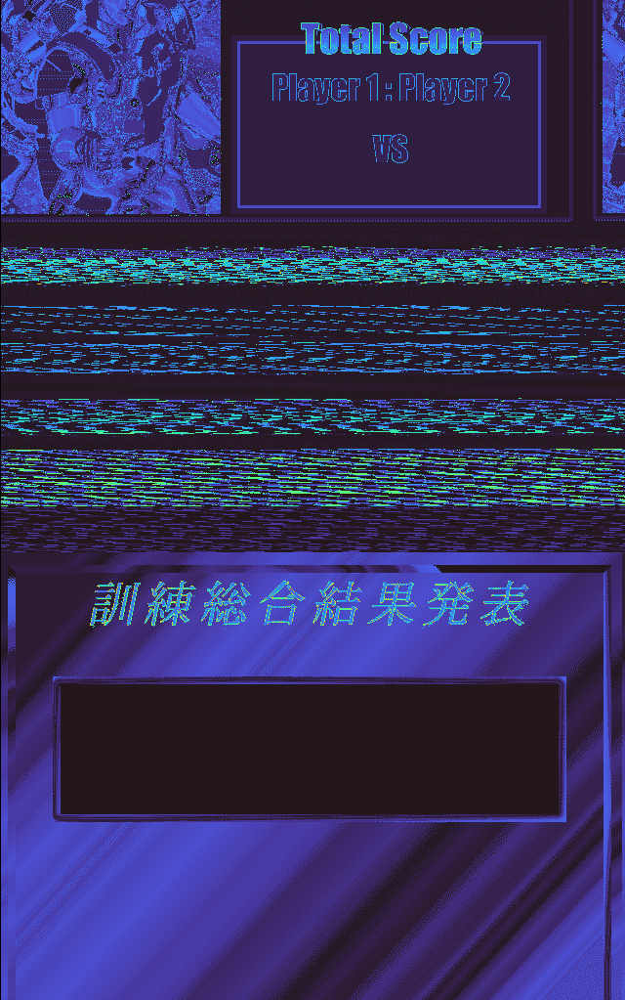
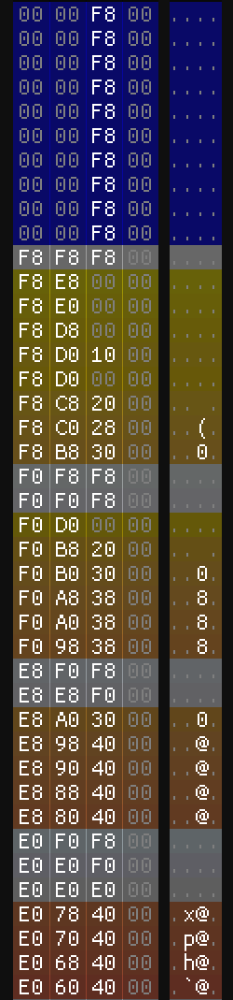

Work in progress reverse engineering of [Virtua Cop 2 PC](https://www.abandonware-france.org/ltf_abandon/ltf_jeu.php?id=669) (1997)

- [Used tools](#used-tools)
- [Assets data structure](#assets-data-structure)
  - [Models](#models)
    - [Header](#header)
    - [Vertices](#vertices)
    - [Indices and faces](#indices-and-faces)
    - [Unknown section](#unknown-section)
  - [Textures (T\_.BIN)](#textures-t_bin)
  - [Color palettes](#color-palettes)

## Used tools

Here is the list of tools I will be refering to:
- [Binocle](https://github.com/sharkdp/binocle) for binary visualization
- [ImHex](https://github.com/WerWolv/ImHex) using its [pattern language](https://docs.werwolv.net/pattern-language) in the `.hexpat` files
- [3D Model Researcher](https://mr.game-viewer.org/about_pro.php) to investigate model data

## Assets data structure

### Models
Models are stored in **P_*.BIN** files divided into 4 sections.

#### Header
The header consists in *n* number of model definitions until a **16 bytes** chunk of **0**s is reached. Each definition is structured like so:

| Size    | Name                 | Description                                |
| ------- | -------------------- | ------------------------------------------ |
| 4 bytes | Vertices data offset | Offset of the model's vertices in the file |
| 4 bytes | Indices data offset  | Offset of the model's indices in the file  |
| 4 bytes | Unknown              | Not sure for now. Maybe UVs?               |
| 2 bytes | Number of vertices   | The number of vertices for this model      |
| 1 byte  | Number of faces      | The number of faces for this model         |
| 1 byte  | Unknown              | -                                          |

Model definition structure

#### Vertices
Vertices are directly stored as a list of **3 &times; 32 bits** float coordinates (XYZ).
| Size    | Name | Description        |
| ------- | ---- | ------------------ |
| 4 bytes | X    | X vertex component |
| 4 bytes | Y    | Y vertex component |
| 4 bytes | Z    | Z vertex component |

#### Indices and faces
Since each face is rendered as a **QUAD**, 4 indices are needed for each face.

Each face is represented like so:
| Size     | Name    | Description              |
| -------- | ------- | ------------------------ |
| 2 bytes  | Index 1 | First index of the face  |
| 2 bytes  | Index 2 | Second index of the face |
| 2 bytes  | Index 3 | Third index of the face  |
| 2 bytes  | Index 4 | Fourth index of the face |
| 12 bytes | Unknown | -                        |

Face indices data structure

#### Unknown section
I suspect this has something to do with UV coordinates or texture mapping.

### Textures (T_.BIN)
Textures are stored in **T_*.BIN** files.

Based on what we can see using **Binocle**, it seems like each pixel is encoded as an **8bit palette index**.

Example of T_MINI_C.BIN captured using Binocle

### Color palettes
Color palettes are defined in **L_*.BIN** files.
Each file contains several color palettes.

| Size   | Name | Description              |
| ------ | ---- | ------------------------ |
| 1 byte | R    | Red color value |
| 1 byte | G    | Green color value |
| 1 byte | B    | Blue color value |

ImHex can help us having a better view on palette data

Example of L_LOGO.BIN captured using ImHex w/ palettes.hexpat pattern
